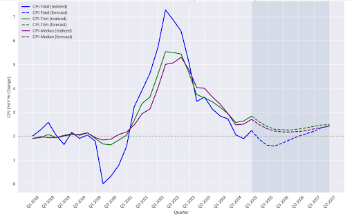
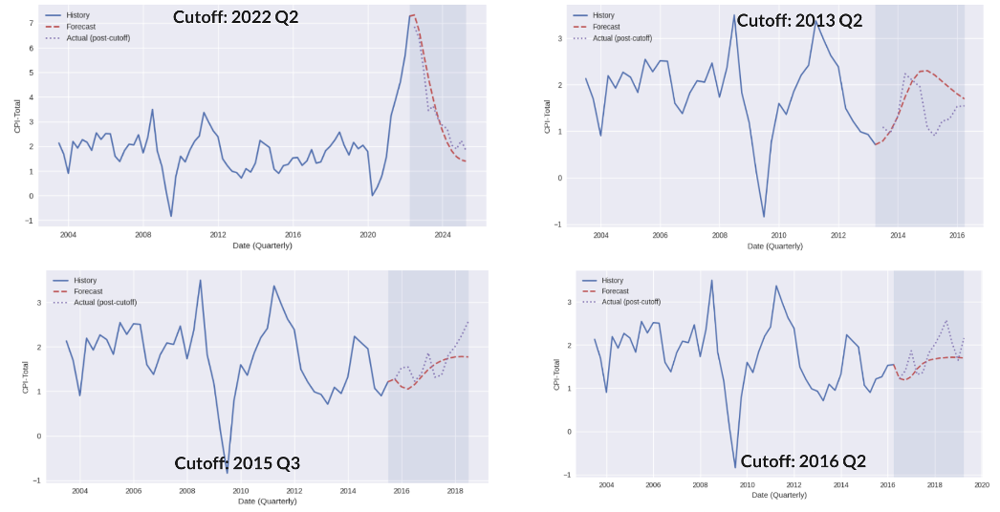

# Project Overview 📊

This project replicates Bank of Canada-style macroeconomic modeling to generate reliable CPI forecasts and recommend optimal interest rate paths that maintain the 2% inflation target. It uses a **Bayesian Vector Autoregression (BVAR)** model and **Monte Carlo** simulations to find the optimal monetary policy path.

## Objective 🎯

Develop a comprehensive forecasting framework that:
- **Forecasts** Canadian CPI inflation 8 quarters ahead with uncertainty bands
- **Simulates** policy responses to external shocks (trade wars, supply chain disruptions)
- **Optimizes** interest rate paths to maintain stable, low, and predictable inflation

## Results Summary 📊

### Conclusion 💡

Our model shows deflationary movement in the short term due to the impact of tariffs, which temporarily suppress price levels through reduced trade volumes and increased import costs. However, as the economy recovers and with the federal stimulus measures including infrastructure spending, direct transfers to households, and business support programs that inject liquidity into the economy, our forecast shows inflation does restabilize to its target of 2%. 

As such, our recommendations to the Bank of Canada as of November 2025 is to hold the current policy rate of 2.25%, and wait for further developments like trade policy changes or supply chain shocks. We also argue that the labour market, particularly the high unemployment rate, is a cyclical issue more than anything else, and that the Bank of Canada should allow it to run its cycle instead of cutting the rate now to try to control it.

The following figure shows our inflation forecast results with confidence intervals.

The following figure shows the backtesting performance of our model.

## Project Steps 🔄

### 1. 📈 Data Collection
- **Statistics Canada (CANSIM)**: CPI, GDP, labour productivity, unemployment
- **Bank of Canada**: Overnight rates, Business Outlook Survey, commodity prices
- **External sources**: US Federal Funds Rate, global supply chain pressure index

### 2. 🧹 Data Cleaning (STATA)
- Quarterly aggregation and seasonal adjustment
- Crisis dummy variables (2008 financial crisis, 2020 pandemic)
- Stationarity testing and transformation (log-differences for growth rates)

### 3. 🤖 Forecasting Model (Python)
- **BVAR with Minnesota priors** for stable forecasting with many variables
- **Shock simulation** capability for external events (trade wars, supply disruptions)
- **Fan charts** showing 50% and 80% confidence intervals

### 4. ⚡ Interest Rate Optimization
- **Beam search algorithm** testing thousands of policy rate combinations
- **Multi-objective optimization**: stability, level, and predictability
- **Constraints**: ±50bp quarterly changes, 25bp increments

## Variables 📋

**Final Model Variables (9 total):**
- `Labour_Prod`: Labour productivity growth (q/q annualized)
- `CEER`: Canadian dollar exchange rate growth
- `GOC5Y`: 5-year Government of Canada bond yield growth
- `BOS`: Business Outlook Survey indicator
- `BCPI`: Bank of Canada commodity price index growth
- `CPI`: Consumer Price Index inflation (target variable)
- `Output_Gap`: Real GDP gap measure
- `GSCPI`: Global Supply Chain Pressure Index
- `Overnight_Rate`: Bank of Canada policy rate

## Model Design 🏗️

**Bayesian VAR Framework:**
- **Lags**: 4 quarters (optimal via testing)
- **Priors**: Minnesota-style shrinkage (φ=0.9, λ=0.2, θ=0.2)
- **Posterior**: Conjugate Normal-Inverse Wishart
- **Draws**: 2,000 posterior samples for uncertainty quantification

**Key Features:**
- **Stationarity**: All variables tested via Augmented Dickey-Fuller tests
- **Shock capability**: One-time additive innovations to any variable
- **Policy conditioning**: Exogenous interest rate paths for optimization
- **Robust evaluation**: Out-of-sample testing with RMSE/MAE metrics

